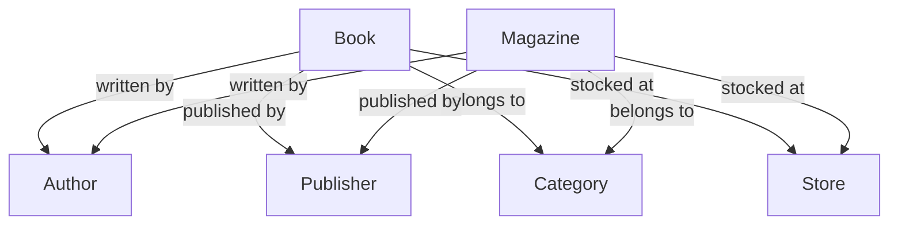
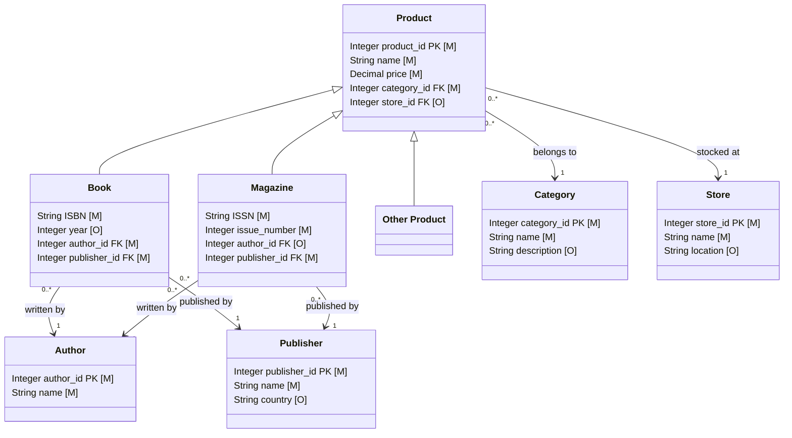

# Ontologies

*I did not use AI on the following documentation, except for the generation of the diagrams. The topic described here is often unstructured, confusing and can be defined differently by different authors, which is why it's important we start from one common place. Here we focus on real life experiences with data modelling, the process that is often done quickly, under hard deadlines, and mistakes are seen rather later than sooner. The motivation comes from these reasons and for any reader to understand the usual process or the alternatives. AI would build a model even faster, with less questions, doing exactly the opposite of what we should have learnt through experiences.*

>It's all about data. 

We are looking to get more information from the data we have, think about banks and other organizations, which want to optimize their spending, find ways to gain more and areas to grow. Companies are paying more to get insights into their data and processes, using consultancy companies or which will come even more common, AI. As consultancy companies, AI also needs context. Consultants know what to ask. With AI, it works the other way. First, we ask. We ask what to improve, what else we can change, make faster. AI normally asks us which path to follow between given ones. It might not doubt the data we have in a way a person would, more specifically, a data modeller.

A data modeller who's job is to model the data in a logical data model, will have do doubt everything. The constant question would be
"Is the model detailed enough, what am I missing?". But they know which question to ask to doubt this less and less. Which takes time.

How do we get to ontologies then? The process of data modelling is a long one. It could end or start with an ontology of the data. All the models would be created much more simply if ontology is created first, but there are many reasons against it. Especially now when we have to build fast. Less questions the better. "Ship first, ask later." Then we end up with a database which does what it was required in the beginning. But once it grows, and we'll want to understand more about the business, we'll end up with the same question. "What is in our data?". Normally in a larger company, each department knows their part of the data well. Often, there are only specific people in the department that know the data well. They've worked with it for years, they know what goes in, what are the rules, the business context of every attribute and enum, every table. They have the knowledge that could be stored in an ontology or metadata dictionary.

To decide what we need to build a database, we need to understand the basic concepts around data modelling. The definitions for these models can vary, so we will use the definitions provided by the [Joint Banking Reporting Committee](https://www.ecb.europa.eu/stats/ecb_statistics/reporting/jbrc/shared/Terms_and_definitions_relevant_for_integrated_reporting.pdf), where they describe the levels of data modelling.

## Levels of data modelling

###  Conceptual data model

> *A conceptual data model is a data model providing a high-level overview of the structure of the data.*

> *It contains only the basic entity types of the domain being in scope of the data model with a (rough) description of each entity type and the relationships between these entity types. As such, it describes how the (most) relevant information is structured. This structure is derived from the ontology, and it decides which terms of the ontology become an entity type, an attribute, or a relationship type. The purpose of a conceptual data model is hence to define, scope and organise different data entities and the relationships between them, without focusing on their detailed characteristics.*

Conceptual data model is probably something everyone does when they start designing a database, whether or not they have an ontology. It's a sketch of the data model, which is often used to create the more detailed model. A very simple example for a conceptual data model a bookstore could use is shown below. 

We can see the important relationships and entities, which describe the domain knowledge. In the definition it's written we can/should include a rough description of the entities. We started here with a realistic diagram, where the people involved assume everyone understands what the definitions of the terms as "Book" is and deem them unnecessary. Whether that is right or wrong, we cannot say. Some might say every object needs definition, no matter how trivial, while others don't think it's worth the time. We could use AI to generate the description for trivial objects nowadays, which is helpful only if a person goes through them carefully and with questioning everything approach. 

**Possible problem with the diagram:** Seeing this diagram we could ask ourselves, what is the category? Does it describe the price range of the book/magazine, or the topic the book is about, like romance or science? Even the concept that someone sees as very trivial, might not be seen as such by others. 

For now we can see how even in the beginning, when everything seems simple, we're running into questions. It's all good as long as someone is asking them.

Next, we might already feel ready to build a database. We just need to add the attributes to the entities and it would be ready for implementation. Lets first explain the rest of the possible data models in the data modelling process.

### Logical data model

> *A logical data model is a detailed representation of data requirements and is independent of any technology or specific implementation constraints. The design of a logical data model often begins as an extension of a conceptual data model as it represents the details on data elements and their relationships.*

> *The purpose of a logical data model is hence to define and organise different data elements and the relationships between them, focusing on their detailed characteristics.*

> *The logical model – through a process of Normalisation – gives a more structured representation of entity types, their characteristics, and their relationship types than the conceptual model by adding attributes, cardinalities and identifying primary as well as foreign keys.*

This is a big one. Depending on how detailed we want to be, a logical data model can provide us with almost all information we need about the data model. 

***What is even a difference between this and a relational model?*** Sometimes, not much. Logical data model should be independent of the  database management system (DBMS), so it wouldn't include the column types that are DBMS specific, but would restrict an attribute to a general type, like a String. But logical data model allows us to provide more information about the data than implementation data model. We can provide hierarchical information on the entities, explicitly and visually restricting the attributes to specific subtype.  

Building on the same bookstore example, we can now extend the conceptual model into a logical one:

In the diagram we see that it includes quite a lot of details. For example, `Book`, `Magazine` and `Other product` are subtypes of the entity `Product`. THis means they all share the common attributes `Name` and `Price`, but we only allow to add an `Author` for books and magazines. We see the primary keys makes with `PK` and foreign keys with `FK`. The attribute properties were added, so we know which is a string and which is an integer. We also have information on which attributes are mandatory and which optional with `[M]` sign. Note that the marks for primary key, mandatoriness differ between the modelling programs, but are usually easy to understand. 

**Possible improvements:** This isn't a great design, it was obviously done in a rush. Some examples of problems are:
- First, all relationships are optional to one. This is incorrect, of course a book can have multiple categories and one category might be used by many books. While  `Other product` probably doesn't have one at all. While the relationship is still technically correct, since we can use the optionality for exclusion of category for other products, it leaves room for error. If at a certain point there is a data analyst that wants to find how many books and magazines are being sold from the category `other` and they simply filter all products by that category, they might not know that other products were sometimes put into the database with category "other". Such a small issue causing possibly big issues with data analysis down the line.
- There is always more information you can provide to the model. Again, the attributes, as trivial as they seem, may be open to interpretation, so description would be useful. 
- Next, how do we know we provided enough detail with the subtypes? Should we have split the `Book` down even further? We all understand what normalisation means (if you don't, no worries, look at [wikipedia](https://en.wikipedia.org/wiki/Database_normalization)), but it doesn't talk about subtyping. It might be completely ignored by the modeller, but it provides a lot of information. The first issue listed can only be avoided with subtyping, as was done for `author` and `publisher`. we might want to  make the model as detailed as we can, with providing all possible subtypes that exist, but that might be unnecessary and time consuming. We want each subtype to be there for a reason, might that be it-s only one with a relationship to another entity, or a specific attribute is included only in that subtype. The balance might be hard ot find at first, but with experience it gets easier seeing the benefits.
- Category has an attribute `name` listed as a string. While that is okay, there might be a list of available categories, which creates a restriction on data entry. This way we prevent errors on input and make it easier for analysis of the data later. 

Already from a very small example we were able to find many interpretations of how to model the data, which rules we should follow, how much detail we should include, etc. Just like with programming best practices, there are also many guides on data modelling best practices, which a data modeller can follow. The problems of data modeling and code architecture are actually very similar and follow the same principles. Especially when we think about creating object relational mappings (ORM) to have a mapping between the relational database and the objects (classes) in a object oriented programming language. This way, if an entity is represented as a class, we can imagine the connection between the software architecture and data architecture very easily. All of this to say, there is no best way to do either. They are carefully thought through by architects on separate basis, while following best practices, there are hard choices to make in both domains.

### Ontology Matching

In this repository we show how we can use Python to do basic ontology matching using test ontologies from [OAEI](https://oaei.ontologymatching.org/). Specifically, we show the use of Levenshtein distance, n-gram similarity, cosine similarity and path distance. 

The extension is in the works.